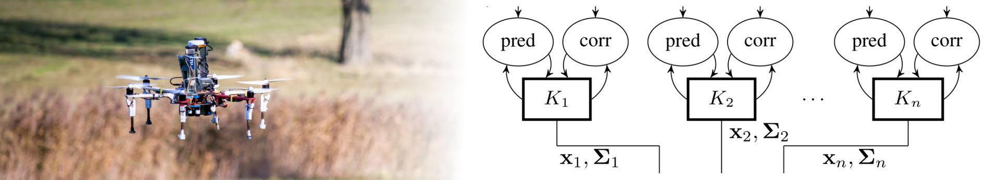

# MRS UAV Odometry



| Build status | [](https://github.com/ctu-mrs/mrs_uav_odometry/actions) | [](https://github.com/ctu-mrs/mrs_uav_odometry/actions) |
|--------------|-------------------------------------------------------------------------------------------------------------------------------------------------|------------------------------------------------------------------------------------------------------------------------------------------------|

This package provides state estimation of the UAV dynamics based on sensor fusion of onboard sensors.
The estimated states are:

* lateral position
* lateral velocity
* lateral acceleration
* heading
* heading rate

Within the [MRS UAV System](https://github.com/ctu-mrs/mrs_uav_system), the resulting state estimate is used by the [ControlManager](https://github.com/ctu-mrs/mrs_uav_managers) for feedback [control](https://github.com/ctu-mrs/mrs_uav_controllers) of the UAV.
The provided *odometry diagnostics* topic is used by the [Gain/Constraint-Managers](https://github.com/ctu-mrs/mrs_uav_managers) for applying proper dynamics constraints and controller gains based on the current estimator type.

## Bank of estimators

The odometry node maintains a bank of filters with independent hypotheses.
Multiple sensors can be combined into a *sensor group*, which is input to one of the estimators.
The estimators run independently and are multiplexed to obtain the *main* estimate.
Only the selected *main* estimated is used for the feedback [control](https://github.com/ctu-mrs/mrs_uav_controllers).
Here follows the list of selected estimators with their inputs.

* "OPTFLOW"
  * horizontal: [optic flow](https://github.com/ctu-mrs/mrs_optic_flow) velocity
  * vertical: range finder height
  * heading: [optic flow](https://github.com/ctu-mrs/mrs_optic_flow) yaw rate
* "GPS"
  * horizontal: GNSS position
  * vertical: range finder height
  * heading: magnetometer
* "OPTFLOWGPS"
  * horizontal: GNSS position, [optic flow](https://github.com/ctu-mrs/mrs_optic_flow) velocity
  * vertical: range finder height
  * heading: magnetometer
* "RTK"
  * horizontal: RTK GNSS position
  * vertical: range finder height
  * heading: magnetometer
* "LIDAR"
  * all states: 3-D LIDAR position and heading
* "VIO"
  * horizontal: Visual Inertial Odometry position
  * heading: Visual Inertial Odometry heading
  * vertical: range finder height
* "HECTOR"
  * horizontal: Hector slam position
  * heading: Hector slam heading
  * vertical: range finder height

## Provided topics

The *main* estimator output currently used for [control](https://github.com/ctu-mrs/mrs_uav_controllers) (in the custom *UavState* message type):
```
/uav*/odometry/uav_state
```
The *main* estimator output currently used for [control](https://github.com/ctu-mrs/mrs_uav_controllers) (in the custom *Odometry* message type):
```
/uav*/odometry/odom_main
```
Particular estimator topics:
```
/uav*/odometry/odom_optflow
/uav*/odometry/odom_gps
/uav*/odometry/odom_optflowgps
/uav*/odometry/odom_rtk
/uav*/odometry/odom_lidar
/uav*/odometry/odom_vio
/uav*/odometry/odom_hector
```

## Switching current estimator

```bash
rosservice call /uav*/odometry/change_odometry_source optflow
```
